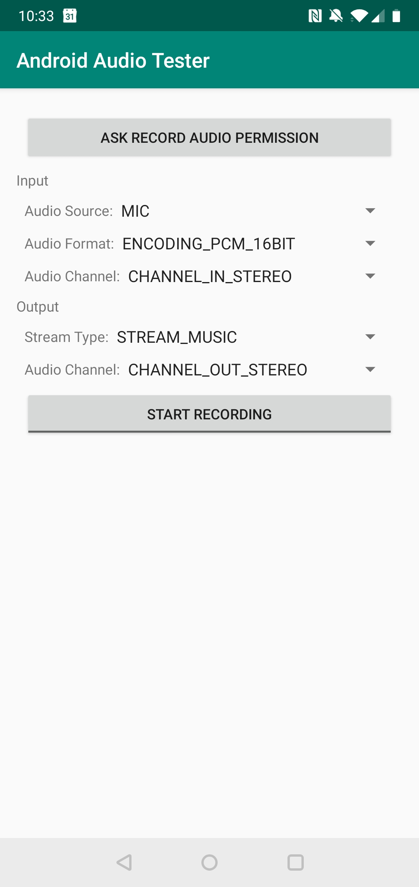

# Android Audio I/O Tester

This repo contains a PoC Android app for testing how this OS uses phone hardware or connected devices for recording and playing audio.

Using this app you can select different sources, formats, and channels for Audio input and stream and play it back with a short delay on audio output by setting types and channels of an audio track.

To start make sure you give access to the microphone using the button on UI.

